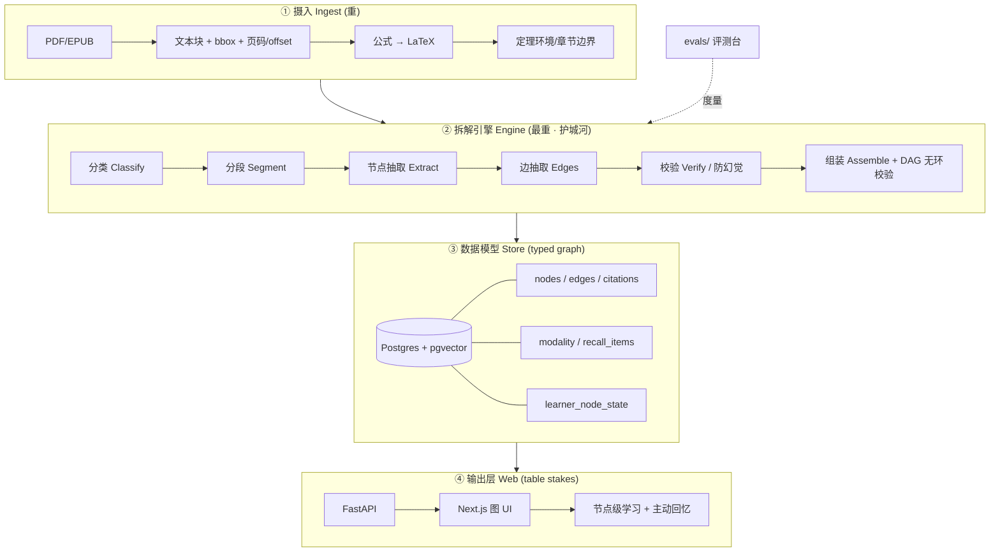

# Atlas 架构设计文档(v0.1)

> 配套文档:[`PRD.md`](./PRD.md)(产品需求,概念源头)
> 本文回答的问题:**"根据 PRD,怎么做?用什么技术栈?"**
> 状态:讨论稿,随 MVP 实现迭代。

---

## 0. 一句话

把工程重心**死死压在拆解引擎**上,数据模型为"类型化知识图 + 原文 provenance"服务,网站是最后一层、最不构成壁垒的一层。本文给出一套**演绎型(数学/定理 DAG)优先**的可落地架构。

---

## 1. 两个已锁定的决策

| 决策 | 取值 | 依据 |
|---|---|---|
| **v1 攻哪类知识架构** | **演绎型**(PRD §5.1 类型 1) | 结构最干净、可拆性 ★★★★★;边语义封闭可枚举,**防幻觉最可落地**;第一本书现成(凸优化)。论证型留作 v2 验证"类型可插拔"。 |
| **本文产出** | 架构设计文档(不含代码脚手架) | 先把承重决策写清楚,再动手。 |

> 为什么不是论证型(PRD §11.1 选项 B):论证型边语义更丰富、商品工具最做不动,但"论点/预设"边界模糊、grounding 判定会糊,v1 上来风险高。它是**更好的 v2**——正好拿来验证引擎的类型可插拔性(PRD §7.3)。

---

## 2. 设计哲学(承重原则)

这几条是约束,不是口号。每条都会在下文落到具体技术决策上。

1. **拆解优先于输出**(PRD §4)。引擎 + 校验 + 评测的工程量,应当 ≫ 数据模型 ≫ 网站。
2. **一切节点可回溯原文**(PRD §5.2.3)。没有 provenance 的节点 = 幻觉,比没有更糟。provenance 从摄入第一步就保留,不是事后补。
3. **类型专属,不做通用切块器**(PRD §3)。schema、抽取 prompt、模态判据都随知识架构变。通用切块器正是竞品浅的根因。
4. **模态判定是可执行判据,不靠手感**(PRD §5.2.4)。规则即代码/配置,可审计、可测试。
5. **拆解是离线批处理,不在请求时**。用户访问的是已经算好的图;LLM 重活全在摄入流水线里。
6. **评测台与引擎同级**(PRD §9)。没有"源文可回溯率/抽取 P-R"的度量,你不知道图是真懂还是幻觉。

---

## 3. 系统总览

四层,重心倒挂(越上游越重)。



**关键架构特征:** 引擎是**离线批处理流水线**,产物落库;网站只读已算好的图 + 写学习者状态。两侧通过 Postgres 解耦。

---

## 4. 拆解引擎(产品核心)

五阶段流水线。**每阶段输出落库并按内容哈希缓存**——改了第 4 阶段不必重跑 1–3(摄入和抽取是最贵的)。

### 4.1 摄入 Ingest —— 数学书真正的难点

数学书的死穴在这里,不在 HTML。通用切块器在这一步就废了(丢公式、丢结构、丢坐标)。

| 任务 | 选型 | 理由 |
|---|---|---|
| PDF → 文本块 + **bbox + 页码 + char offset** | **PyMuPDF** | provenance 的物理地基。每个块带坐标和偏移。 |
| 公式 → LaTeX | **Marker** / **Nougat**(学术 PDF→MD+LaTeX);硬骨头上 **Mathpix** API | 数学书丢了公式就废了。 |
| 定理环境 / 章节边界 | 规则 +(可选)GROBID | 抽 `\begin{theorem}`、编号、章节树。 |

> **不变量(贯穿全系统):** 一切下游节点都必须能携带 `(document_id, page_no, char_start, char_end, quote)`。这是 PRD §5.2.3 "正典约束"的物理基础,从摄入第一步就必须保住。

### 4.2 分类 Classify

判定整本书的知识架构(PRD §5.1)。v1 只接受**演绎型**;非演绎型直接拒绝并说明,而不是强行套(避免范畴错误,PRD §5.1 对虚构的判断同理)。用 **Haiku** 跑(便宜的分类)。

### 4.3 抽取 Extract —— Claude 多代理 + 结构化输出

引擎用 **Anthropic SDK**,Pydantic 定义 schema,走 **structured output / tool use**;成本分层(Haiku 干便宜活,Opus 干硬抽取/校验)。

| Agent | 模型 | 职责 | 输出 |
|---|---|---|---|
| **Segmenter** | Haiku | 切逻辑块、识别定理/定义/证明环境 | 带 span 的块序列 |
| **Node Extractor** | Opus | 每块抽**类型化节点**,带**精确原文 quote** | `Node[]` |
| **Edge Extractor** | Opus | 给定节点 + 局部上下文,推**类型化边** | `Edge[]` |
| **Verifier** | Opus(独立 pass) | 见 §4.4 | grounded 标记 + 置信度 |

**必用的 Anthropic 能力:**
- **Prompt caching**:处理一本书 = 在同一批上下文上发很多次调用 → 缓存书的 chunk,成本/延迟大降。这是把单本书拆解成本压下来的关键(PRD §11.5)。
- **Citations**:让模型输出可回溯到原文 chunk 的引用,天然服务 §4.4 的 grounding。
- **结构化输出**:强约束到 Pydantic schema,杜绝自由发挥。

> 编排**先别上重框架**:纯 Python 管道 + 落盘缓存即可。需要重试/可观测/并发再上 **Prefect**(或 Temporal)。LangGraph / Agent SDK 是后话,不做 v1 地基。

### 4.4 校验 Verify —— 防幻觉是核心质量门,不是附属功能

这是护城河本体(PRD §3.2、§5.2.3)。**独立的一道 pass**,不与抽取共享上下文偏见。

对每个**节点**和每条**边**:
1. **原文蕴含检查**:"被引用的这段原文,是否真的支持这个节点/这条边?" 用 Opus 做 NLI 式判定,输出 `grounded ∈ {yes, partial, no}` + 置信度。
2. **quote 精确匹配**:`quote` 必须是 `(page, char_start, char_end)` 处的真实子串(代码校验,零成本,抓幻觉引用)。
3. 不达标 → 标记 `verified=false`,**默认不进图**(进 quarantine,人工抽检)。

**演绎型独有的免费校验信号:** 学习序 DAG(见 §5.3)**必须无环**。抽出环 = 抽错了(比如把定理和它的推论方向搞反)→ 自动报警,无需人工。

判定标准(回答 PRD §11.3):
- "可回溯" = quote 精确命中原文 **且** 蕴含检查 ≥ `partial`。
- 误判处理:`partial` 与低置信项进**人工抽检队列**;评测台用 gold set 校准阈值(§9)。

### 4.5 组装 Assemble

纯代码,不调 LLM:节点去重(同一定理多处引用合一)、边方向归一、构建学习序 DAG、**拓扑排序 + 环检测**、写入 Postgres。环 → 退回 §4.4 复检。

---

## 5. 数据模型:演绎型 typed property graph

**默认 Postgres + pgvector,不要一上来上 Neo4j。** 理由:provenance 天然关系型;单本书规模,DAG 遍历用 recursive CTE 足够;pgvector 顺带服务例题检索与相似回忆。真成瓶颈再引专用图库。

### 5.1 节点类型(拆解的最小单元,PRD §5.2.1)

演绎型的最小单元是**数学对象**,不是"段落":

```
definition  公理化定义        axiom      公理/假设
notation    记号约定          lemma      引理
theorem     定理              proposition 命题
corollary   推论              proof      证明(可挂在被证对象上)
example     例题              counterexample 反例
remark      注记/直觉
```

### 5.2 边类型表(PRD §5.2.2 的核心:类型化的边,不只是"前提")

这正是 PRD 反复强调"决定图是否真懂这本书"的地方。

| 边类型 | 方向语义 | 是否进学习序 DAG | 备注 |
|---|---|---|---|
| `depends_on` | A 依赖 B(B 是前置) | ✅ 主干 | 核心依赖。 |
| `uses` | A 的证明用到 B | ✅ | 证明级依赖。 |
| `corollary_of` | A 是 B 的推论 | ✅ | A 在 B 之后学。 |
| `special_case_of` | A 是 B 的特例 | ✅ | 学 A 需先有 B。 |
| `proves` | proof P 证明 T | ✅ | P 紧跟 T。 |
| `example_of` | E 是 C 的例子 | ✅(弱) | 例题检索用。 |
| `counterexample_to` | X 反驳 S | ➖ overlay | 显式化张力。 |
| `generalizes` | A 推广了 B | ➖ overlay | `special_case_of` 的逆,存规范方向即可。 |
| `equivalent_to` | A 与 B 等价(对称) | ➖ overlay | 不进 DAG(对称会成环)。 |
| `intuition_for` | R 是 T 的直觉版 | ➖ overlay | 挂"先给直觉"的教学。 |

> **关键设计:不是所有边都进 DAG。** "学习序 DAG" = `depends_on ∪ uses ∪ corollary_of ∪ special_case_of ∪ proves ∪ example_of` 的并,**必须无环**(§4.4 的免费校验)。`equivalent_to / intuition_for / generalizes / counterexample_to` 是**语义覆盖层**,服务教学呈现与导航,不参与排序、不受无环约束。这套类型化边表就是 PRD 说的"图是否真懂这本书"的载体。

### 5.3 Postgres DDL(草案)

```sql
CREATE EXTENSION IF NOT EXISTS vector;

-- 来源与 provenance 基座 -----------------------------------
CREATE TABLE documents (
  id            uuid PRIMARY KEY DEFAULT gen_random_uuid(),
  title         text NOT NULL,
  source_path   text NOT NULL,
  architecture  text NOT NULL DEFAULT 'deductive',  -- 分类结果
  content_hash  text NOT NULL,                       -- 缓存键
  created_at    timestamptz NOT NULL DEFAULT now()
);

CREATE TABLE pages (              -- 摄入产物,保留坐标/偏移
  document_id   uuid REFERENCES documents(id),
  page_no       int NOT NULL,
  text          text NOT NULL,
  blocks        jsonb NOT NULL,   -- [{bbox, char_start, char_end, latex?}]
  PRIMARY KEY (document_id, page_no)
);

-- 知识图 -------------------------------------------------
CREATE TYPE node_type AS ENUM (
  'definition','axiom','notation','lemma','theorem',
  'proposition','corollary','proof','example','counterexample','remark');

CREATE TABLE nodes (
  id            uuid PRIMARY KEY DEFAULT gen_random_uuid(),
  document_id   uuid REFERENCES documents(id),
  type          node_type NOT NULL,
  label         text NOT NULL,            -- "定理 3.2 (强对偶)"
  statement     text NOT NULL,            -- 规范化陈述(含 LaTeX)
  embedding     vector(1024),             -- 检索 / 相似回忆
  verified      boolean NOT NULL DEFAULT false,
  created_at    timestamptz NOT NULL DEFAULT now()
);
CREATE INDEX ON nodes USING hnsw (embedding vector_cosine_ops);

CREATE TYPE edge_type AS ENUM (
  'depends_on','uses','corollary_of','special_case_of','proves',
  'example_of','counterexample_to','generalizes','equivalent_to','intuition_for');

CREATE TABLE edges (
  id            uuid PRIMARY KEY DEFAULT gen_random_uuid(),
  src           uuid REFERENCES nodes(id),
  dst           uuid REFERENCES nodes(id),
  type          edge_type NOT NULL,
  in_dag        boolean NOT NULL,         -- 是否进学习序 DAG(§5.2)
  confidence    real,
  verified      boolean NOT NULL DEFAULT false,
  UNIQUE (src, dst, type)
);

-- 防幻觉:每个节点/边可回溯到原文 -----------------------
CREATE TABLE citations (
  id            uuid PRIMARY KEY DEFAULT gen_random_uuid(),
  node_id       uuid REFERENCES nodes(id),       -- 或 edge_id,二选一
  edge_id       uuid REFERENCES edges(id),
  document_id   uuid REFERENCES documents(id),
  page_no       int NOT NULL,
  char_start    int NOT NULL,
  char_end      int NOT NULL,
  quote         text NOT NULL,                   -- 必须等于原文子串
  entailment    text NOT NULL,                   -- 'yes'|'partial'|'no'
  confidence    real NOT NULL,
  CHECK (num_nonnulls(node_id, edge_id) = 1)
);

-- 模态判定(规则即数据,§6) ----------------------------
CREATE TABLE node_modality (
  node_id       uuid PRIMARY KEY REFERENCES nodes(id),
  modality      text NOT NULL,   -- self_paced_text|static_diagram|stepwise_reveal|animation
  features      jsonb NOT NULL,  -- 触发该判定的特征
  rationale     text
);

-- 主动加工(§7) --------------------------------------
CREATE TABLE recall_items (
  id            uuid PRIMARY KEY DEFAULT gen_random_uuid(),
  node_id       uuid REFERENCES nodes(id),
  kind          text NOT NULL,   -- cloze|recall|apply|prove_step
  prompt        text NOT NULL,
  answer        text NOT NULL,
  distractors   jsonb,
  grounded      boolean NOT NULL DEFAULT false,  -- 生成后回原文复校
  citation_id   uuid REFERENCES citations(id)
);

-- 学习者模型(§7):每用户 × 每节点 ---------------------
CREATE TABLE learner_node_state (
  user_id        uuid NOT NULL,
  node_id        uuid REFERENCES nodes(id),
  p_known        real NOT NULL DEFAULT 0.1,   -- BKT 掌握概率
  stability      real,                         -- FSRS
  difficulty     real,                         -- FSRS
  due_at         timestamptz,
  last_review_at timestamptz,
  reps           int NOT NULL DEFAULT 0,
  lapses         int NOT NULL DEFAULT 0,
  state          text NOT NULL DEFAULT 'new',  -- new|learning|review|relearning
  PRIMARY KEY (user_id, node_id)
);

-- 流水线缓存 / 可观测 ----------------------------------
CREATE TABLE extraction_runs (
  id            uuid PRIMARY KEY DEFAULT gen_random_uuid(),
  document_id   uuid REFERENCES documents(id),
  stage         text NOT NULL,        -- ingest|segment|extract|edges|verify|assemble
  input_hash    text NOT NULL,        -- 命中即跳过
  status        text NOT NULL,
  metrics       jsonb,
  created_at    timestamptz NOT NULL DEFAULT now(),
  UNIQUE (document_id, stage, input_hash)
);
```

> 学习序 DAG 用 recursive CTE 遍历(前置闭包、最近可学前沿)。单本书量级,够用。

---

## 6. 模态判定层(PRD §5.2.4 —— 区别于所有商品化工具的核心)

**规则即代码**,不靠手感。理论依据:认知负荷理论 + Mayer 多媒体学习 + transient information effect(PRD §1.2、§10)。**核心反直觉点:动画不是默认更好,对抽象内容反而加重负荷。**

每个节点先抽特征,再走优先级判据:

```python
# 伪代码:可审计、可单测的判据(落在 engine/modality/)
def decide_modality(f: NodeFeatures) -> Modality:
    if f.is_process:            # 迭代算法/随时间展开的过程(如梯度下降迭代)
        return ANIMATION        # ← 动画唯一真正发光处:学习者可控播放
    if f.is_spatial:            # 几何/区域/超平面/向量(如凸集、分离超平面)
        return STATIC_DIAGRAM   # 静态图 + 可选参数交互
    if f.is_multistep_derivation:  # 多步证明
        return STEPWISE_REVEAL  # 逐步揭示 + 先答再看
    return SELF_PACED_TEXT      # 抽象/符号/定义:可自控节奏文字 + 检索练习
```

| 特征 | 触发模态 | CLT 依据 |
|---|---|---|
| 过程性/时序(算法迭代) | **动画**(可控播放) | 过程在时空展开,动画才有增益 |
| 空间性(几何/区域) | **静态图**(+参数交互) | 空间信息;静态图避免 transient 负担 |
| 多步推导(证明) | **逐步揭示** + 先答再看 | 分块呈现,降内在负荷 |
| 抽象/符号/定义 | **自控节奏文字** + 检索练习 | 动画对抽象内容**降低**学习效果 |

特征本身可由抽取阶段产出(节点是否含图/坐标/迭代/纯符号),判据层只做映射 → 完全可单测、可回归。

---

## 7. 学习者模型 + 主动加工(PRD §5.2.5 / §5.2.6)

**掌握度追踪:BKT**(Bayesian Knowledge Tracing)逐节点存 `p_known`。
**间隔重复调度:FSRS**(开源、现代,优于 SM-2)产出 `due_at`。两者写入 `learner_node_state`。

**冷启动(回答 PRD §11.2):** 没有行为数据时,**拿 DAG 前置结构当先验**——
- 掌握度沿 `depends_on` 传播:前置已掌握 → 后继 `p_known` 先验抬高;根节点起步低。
- 一个**快速 placement 诊断**:探测少数"前沿节点"(高出度、承上启下),迅速定位学习者的理解前沿断在哪条边上,而不是等数据积累。

**主动加工挂载(§5.2.6):**
- `recall_items` 按节点类型生成:定义→cloze;定理→陈述回忆/适用条件;证明→`prove_step`(挡住下一步先答);例题→apply。
- **先答再看**嵌在节点呈现里(desirable difficulties);**间隔重复**由 FSRS 调度。
- 题目由 Claude 从节点生成,且**回原文走同一道防幻觉门**(`recall_items.grounded`)——生成题也不许幻觉。

> 这一层让产物"活":系统知道**这个**读者断在图的哪条边上,据此决定下一步走哪条路径(PRD §5.2.5)。

---

## 8. 输出层:网站(最后做,table stakes)

| 任务 | 选型 |
|---|---|
| 引擎/数据 API | **FastAPI**(Python),REST/JSON;只读已算好的图 + 写学习者状态 |
| 前端 | **Next.js + TypeScript** |
| 知识图可视化 | **React Flow**(自定义节点 + DAG 交互最顺);图变大再换 Cytoscape.js |
| 数学渲染 | **KaTeX** |
| 节点级交互 | React 组件:按 §6 模态呈现 + 先答再看 + FSRS 状态 |

核心交互(PRD §6):可导航交互式知识图 → 节点级按判据呈现模态 → 主动回忆嵌入 → 学习者沿依赖图自控前进/回溯。**拆解绝不放请求时**。

---

## 9. 评测台(`evals/`,与引擎同级 —— PRD §9)

没有它,你不知道图是真懂还是幻觉。对第一本书手工标一份 **gold set**(节点 + 边),持续度量:

- **抽取质量**:节点/边的 precision / recall(对 gold set)。
- **源文可回溯率**:`% grounded`(citations 命中 + 蕴含 ≥ partial)——防幻觉硬指标。
- **DAG 健康度**:环数量(应为 0)、孤儿节点率。
- **学习成效**(有用户后):节点级检索练习正确率 + 间隔后保持率。
- ⚠️ 不看"生成了多少页/多少书"这类虚荣指标(PRD §9)。

阈值(§4.4 的 grounding 判定)由 gold set 校准。

---

## 10. 仓库结构(monorepo)

```
atlas/
  engine/              # Python:护城河
    ingest/            # PDF/EPUB → text + spans + LaTeX
    classify/          # 知识架构识别(v1 只放行演绎型)
    extract/           # 多代理类型化抽取(Claude)
    verify/            # 原文 grounding / 防幻觉(独立 pass)
    graph/             # 组装 typed DAG + 无环校验
    modality/          # 模态判定(规则即代码,可单测)
    schemas/           # Pydantic: Node/Edge/Citation/...
    cli.py             # 对一本书跑全链路
  api/                 # FastAPI:图 + 学习者模型接口
  web/                 # Next.js:图 UI + 节点学习 + 主动回忆
  db/                  # Postgres 迁移(DDL §5.3)
  evals/               # gold set + 抽取质量 / 可回溯率评测台
  docs/                # PRD.md / ARCHITECTURE.md
```

---

## 11. MVP 最薄可用切片(证明护城河,够了)

> **第一本书:Boyd & Vandenberghe《Convex Optimization》**(斯坦福官方免费 PDF,合法可测;你本人在读)。取前几章。

一条线打穿,不铺宽:

```
摄入(带 LaTeX + span)
  → 抽 定义/定理/证明 + 类型化依赖边
  → 原文校验(quote 精确匹配 + 蕴含)
  → Postgres typed DAG(无环校验)
  → Next.js 图 viewer(KaTeX)+ 节点上一个"先答再看"
  → evals 测源文可回溯率
```

MVP 成功 = **可回溯率达标 + DAG 无环 + 能沿依赖图学完前几章的核心定理链**。不是"页面好看"。

---

## 12. 技术栈总表

| 层 | 选型 | 备选 / 升级路径 |
|---|---|---|
| PDF 解析 + provenance | PyMuPDF | — |
| 公式 → LaTeX | Marker / Nougat | Mathpix(硬骨头) |
| 抽取 / 校验 LLM | Claude(Opus 硬活 + Haiku 廉价分类),Anthropic SDK | — |
| LLM 关键能力 | Prompt caching · Citations · 结构化输出 | — |
| 编排 | 纯 Python 管道 + 落库缓存 | Prefect / Temporal(需要时) |
| 存储 | Postgres + pgvector | 真瓶颈再上图库 |
| 后端 API | FastAPI | — |
| 前端 | Next.js + TypeScript | — |
| 图可视化 | React Flow | Cytoscape.js(图大时) |
| 数学渲染 | KaTeX | MathJax |
| 掌握度 / 调度 | BKT + FSRS | — |
| 评测 | 自建 gold set + 指标脚本 | — |

---

## 13. 风险与缓解(诚实排序)

| 风险 | 等级 | 缓解 |
|---|---|---|
| **PDF→LaTeX 数学摄入**(最易低估) | 🔴 高 | 早做 spike;先验证 Marker/Nougat 在目标书的公式还原率;留 Mathpix 兜底 |
| **抽取幻觉 / 图不可信**(护城河本体) | 🔴 高 | 独立 verifier pass + quote 精确匹配 + DAG 无环 + evals gold set 持续度量 |
| **类型化 schema 选错**(整张图歪) | 🟠 中 | v1 锁演绎型;schema 在第一本真实书上压测后再固化 |
| 单本书拆解成本/时延(PRD §11.5) | 🟠 中 | prompt caching + 成本分层(Haiku/Opus)+ 阶段缓存;离线批处理不计入用户时延 |
| 过早上重框架/图库 | 🟢 低 | 默认 Postgres + 纯 Python,按需升级 |
| 滑回"通用切块换皮"(PRD §8) | 🟢 低(纪律问题) | 把 §2 承重原则当 review checklist |

---

## 14. PRD §11 待决问题 —— 当前答案

| # | 问题 | 当前答案(本文给出) |
|---|---|---|
| 1 | v1 攻哪类 | **演绎型**(§1)。论证型 = v2 验证类型可插拔。 |
| 2 | 学习者模型冷启动 | DAG 前置结构当先验 + 快速 placement 诊断(§7)。 |
| 3 | 原文校验判定标准 | quote 精确命中 **且** 蕴含 ≥ partial = 可回溯;partial/低置信进人工抽检;gold set 校准阈值(§4.4、§9)。 |
| 4 | 各架构边类型表 | 演绎型边表已定(§5.2);v2 论证型(支持/反驳/预设/回应/限定)按同结构扩展。 |
| 5 | 拆解成本与时延 | prompt caching + 成本分层 + 阶段缓存 + 离线批处理(§4.3、§13)。 |

---

## 15. Phasing 路线图(对齐 PRD §7.3)

- **v1 / MVP**:演绎型单本书全链路(§11)+ 评测台。我们自己当第一个挑剔用户。
- **v2**:接入第 2 类(**论证型**)。验证引擎"类型可插拔":新增 schema + 抽取 prompt + 边表 + 模态判据,**不动核心流水线**。这是对架构最重要的一次检验。
- **v3**:学习者模型自适应路径(沿断边自动选下一步)。
- **v?(待验证)**:创作侧闭环、所有权/分成 —— **先验证需求再说**,不作地基(PRD §7.2)。

---

*下一步建议:对 Boyd 前几章跑一次摄入 spike,先确认公式还原率与 span 保真度 —— 难的从来不是 HTML,是拆解本身。*
